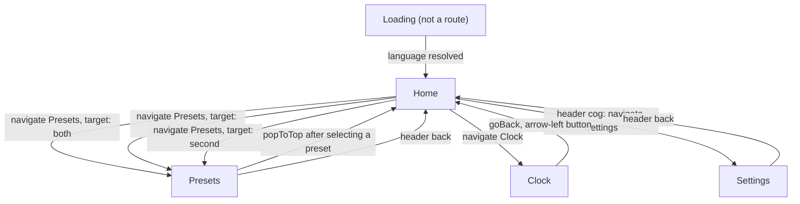
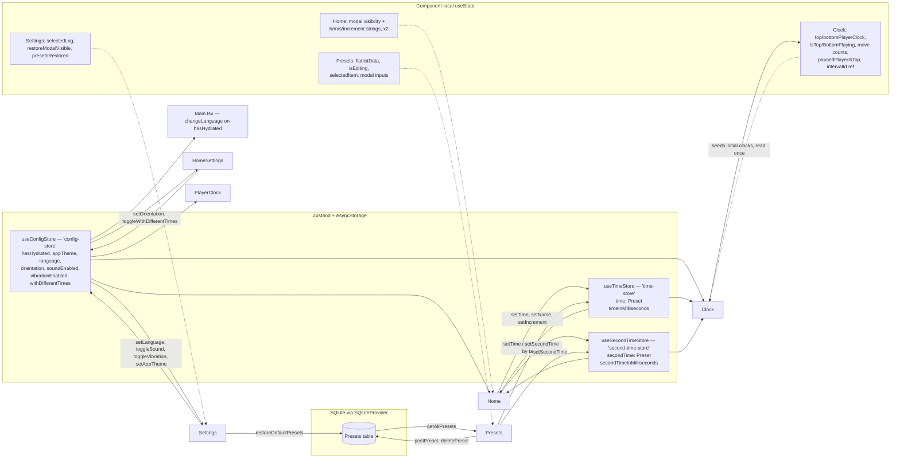
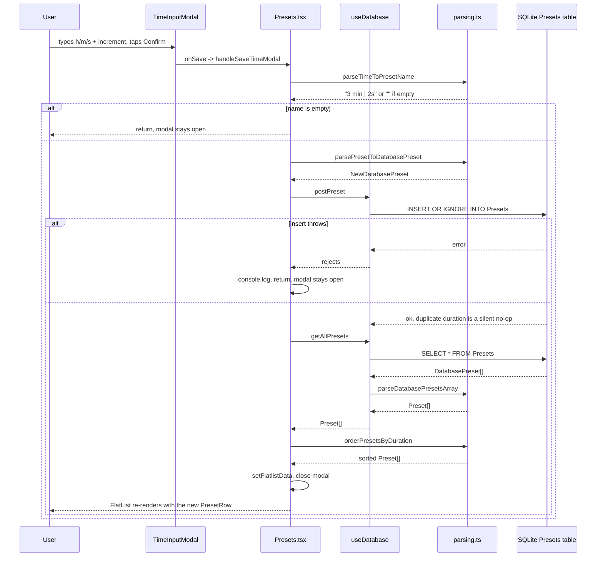

# Architecture

## Overview

Chess Clock is an Expo SDK 57 / React Native 0.86 app (React 19.2, TypeScript 6 in strict mode), built and shipped for Android only — `app.json` has no `ios` block and every `eas.json` build script passes `--platform android`. Navigation is `@react-navigation/native-stack` v7 with four routes declared in a single file. State is split between three Zustand stores persisted to AsyncStorage and one SQLite table accessed through `expo-sqlite`'s `SQLiteProvider`. There is no HTTP client, no server, and no data-fetching library: the only "data layer" is the local SQLite `Presets` table. UI is plain React Native `StyleSheet` over a single token file, with `react-native-element-dropdown` and `react-native-modal` as the only UI dependencies. Text is translated into 36 locales through `i18next` / `react-i18next`, all bundled at build time.

## Directory structure

```
.
├── index.ts                  registerRootComponent entry point
├── App.tsx                   provider stack: gesture handler, safe area, SQLite, navigation
├── Main.tsx                  resolves startup language, renders Loading until i18n is ready
├── Navigator.tsx             native stack + the two custom Header components
├── i18n.ts                   i18next init; maps 36 locale bundles to underscore resource keys
├── app.json                  Expo config: Android package, VIBRATE permission, config plugins
├── eas.json                  EAS build profiles (development / preview / production)
├── assets/                   app icons, splash image, click.mp3 move sound
└── src/
    ├── screens/              one file per navigator route, plus the non-route Loading screen
    ├── components/           presentational building blocks; no data access except HomeSettings/PlayerClock reading the config store
    ├── stores/               Zustand stores, each with the persist middleware over AsyncStorage
    ├── hooks/                a single hook, useDatabase, wrapping every SQL statement
    ├── utils/                constants, SQLite migrations, all parsing/formatting helpers
    ├── types/                shared types: navigation params, DB rows, domain models, languages, i18next augmentation
    ├── resources/            theme tokens and the bundled default presets JSON
    └── locales/             36 `<code>/translation.json` files plus a barrel index.ts
```

## Navigation map

Four routes are registered in [Navigator.tsx](../Navigator.tsx), all inside one `createNativeStackNavigator`, with `initialRouteName="Home"`. `Loading` is a screen component but not a route — [Main.tsx](../Main.tsx) renders it directly in place of the navigator while the language resolves. There are no tabs, drawers, or nested navigators.



The three `Home → Presets` edges are the same route with a different `target` param ([src/types/navigation.ts](../src/types/navigation.ts)); Home picks `primary`/`second` when per-player times are on and `both` otherwise. `Presets` reads `route.params?.target` and applies the chosen preset to one or both time stores before calling `popToTop()`. `Clock` is the only screen with `headerShown: false`; `Home` gets a custom header with a settings button, `Presets` and `Settings` share a `HeaderWithLabel` header, and the `Presets` title is built by concatenating the translated label with `" 1"` or `" 2"`.

## State management

Three Zustand stores, all created with the `persist` middleware and `createJSONStorage(() => AsyncStorage)`. There is no Context provider for app state — components subscribe to stores directly, so state is never threaded through navigation params (the only param in the app is `Presets.target`). Screen-local state is plain `useState`; the clock's entire game state is local to [src/screens/Clock.tsx](../src/screens/Clock.tsx) and is lost when the screen unmounts.



Notes on the flow:

- `timeInMilliseconds` / `secondTimeInMilliseconds` are derived fields recomputed manually inside `setTime` / `setSecondTime` via `getTimeInMillisecondsFromPreset`; nothing recomputes them on rehydration.
- `hasHydrated` exists only in the config store and is set by `onRehydrateStorage` on both the success and failure paths. `Main.tsx` blocks on it before choosing between the persisted language and the device locale from `react-native-localize`.
- `useSecondTimeStore` is only consulted when `withDifferentTimes` is true; in shared mode `Clock` seeds both sides from `timeInMilliseconds` and applies `timeIncrementMs` to both.
- Selecting a preset in `Presets` writes to the stores and pops back — the Home screen re-renders from the store rather than receiving a result param.

## Data layer

There is no network layer: no `fetch`/`axios` call, no API client module, no React Query or SWR, no caching layer, and no environment-configured base URL anywhere in the source. The only persistent data source is the local SQLite database `chessclock.db`, opened by `SQLiteProvider` in [App.tsx](../App.tsx) and accessed exclusively through the [useDatabase](../src/hooks/useDatabase.ts) hook, which holds all four statements (`getAllPresets`, `postPreset`, `deletePreset`, `restoreDefaultPresets`). Schema creation and the two migrations live in `onSQLiteProviderInit` ([src/utils/databaseActions.ts](../src/utils/databaseActions.ts)), keyed off `PRAGMA user_version`; the 0→1 migration creates the table and seeds it from `defaultpresets.json`, and the 1→2 migration dedupes by duration and adds a unique index.

Rows are transformed at the hook boundary: `getAllPresets` maps flat `DatabasePreset` rows to nested `Preset` objects via `parseDatabasePresetsArray`, and writes go the other way through `parsePresetToDatabasePreset`. Results are not cached — `Presets` re-runs the query into local `useState` on mount and again after every write. Errors are caught at the call site and only `console.log`ged; on failure the screen returns early and leaves the modal open so the action can be retried.

Representative flow — creating a preset on the Presets screen, which covers write, re-read, transform and render:



## Native modules, permissions and platform branches

Native modules in use: `expo-sqlite` (preset storage), `expo-audio` (`useAudioPlayer` for the move click in `Clock`), `expo-keep-awake` (`useKeepAwake` for the whole Clock screen), `expo-constants` (`statusBarHeight`), `react-native-localize` (device locale at startup), `react-native-gesture-handler` and `react-native-screens` / `react-native-safe-area-context` (navigation infrastructure), `@react-native-async-storage/async-storage` (store persistence), and React Native's own `Vibration` API for the game-over buzz. `expo-font`, `expo-asset`, `expo-splash-screen`, `expo-build-properties` and `expo-dev-client` are present only as config-plugin entries in `app.json` — no source file imports them.

Permissions: `android.permission.VIBRATE` only, declared in `app.json`.

Platform-specific branches: effectively none. There is no `Platform.OS` check, no `.ios.tsx` / `.android.tsx` file, and no `ios` config block. The single iOS-aware line is the `ios_backgroundColor` prop on the `Switch` in [src/components/SettingSwitch.tsx](../src/components/SettingSwitch.tsx), which is inert on Android. The vibration pattern in `Clock.tsx` is written for Android's `[wait, buzz, ...]` interpretation and would behave differently on iOS.

## Dependencies

Non-dev dependencies from [package.json](../package.json):

- `@expo/vector-icons` — MaterialCommunityIcons, the only icon set; used in eight components and the Presets screen.
- `@react-native-async-storage/async-storage` — backing storage for all three persisted Zustand stores.
- `@react-navigation/elements` — the `Header` component used to build both custom headers, and `useHeaderHeight` for Home's keyboard offset.
- `@react-navigation/native` — `NavigationContainer` and the core navigation types.
- `@react-navigation/native-stack` — the app's only navigator, with its `NativeStackScreenProps` types.
- `expo` — the SDK itself and `registerRootComponent`.
- `expo-asset` — config plugin only; no imports in source.
- `expo-audio` — `useAudioPlayer` plays `assets/click.mp3` on each move when sound is enabled.
- `expo-build-properties` — config plugin that enables release-build minification on Android.
- `expo-constants` — supplies `statusBarHeight` for the rotated top clock's padding.
- `expo-dev-client` — development builds; not imported in source.
- `expo-font` — config plugin only; no imports in source.
- `expo-keep-awake` — keeps the screen on for the lifetime of the Clock screen.
- `expo-splash-screen` — config plugin defining the splash image and background.
- `expo-sqlite` — `SQLiteProvider` plus `useSQLiteContext`; stores and migrates the Presets table.
- `expo-status-bar` — light status bar on the Loading screen and around the navigator.
- `i18next` — translation engine, initialised with all 36 locale bundles.
- `react` — UI runtime.
- `react-i18next` — `useTranslation` in screens and components, and the `initReactI18next` binding.
- `react-native` — the platform.
- `react-native-element-dropdown` — the language picker on Settings; its only use.
- `react-native-gesture-handler` — `GestureHandlerRootView` at the root, required by the native stack.
- `react-native-localize` — reads the device locale when no language has been persisted.
- `react-native-modal` — the modal shell behind `TimeInputModal` and `ConfirmationModal`, giving backdrop and hardware-back dismissal.
- `react-native-safe-area-context` — `SafeAreaProvider` and `initialWindowMetrics` for the bottom inset.
- `react-native-screens` — native screen optimisation required by React Navigation.
- `zustand` — the three stores and their `persist` middleware.

## Known issues

Dead or placeholder code — the unused component, helpers, types, store setters and styles previously listed here have been deleted. One item remains, deliberately:

- The theme feature is half-built: `appTheme` is in the store and persisted, `SHOW_THEME_SETTING` in [src/utils/constants.ts:9](../src/utils/constants.ts#L9) hides the UI, and nothing reads `appTheme` to actually apply a theme. [forfutureself.md](../forfutureself.md) lists "theme" as the outstanding item, so this is unfinished work rather than debt — it is deliberately gated and left in place.

Likely bugs, both in the SQLite setup and both still open:

- [src/utils/databaseActions.ts:31](../src/utils/databaseActions.ts#L31) builds the seed `INSERT` by string interpolation through `parseJSONPresetsToQueryValue`, which wraps preset names in single quotes with no escaping. Today the input is only the bundled JSON, so it works, but a default preset name containing an apostrophe would break the 0→1 migration. Every other statement in the codebase uses bound parameters.
- [src/utils/databaseActions.ts:56](../src/utils/databaseActions.ts#L56) `onSQLiteProviderError` re-throws inside an async provider callback, which produces an unhandled rejection instead of a recoverable path — unlike the config store's rehydration handler, which degrades to defaults.

Duplication and inconsistency:

- [src/stores/useTimeStore.ts](../src/stores/useTimeStore.ts) holds two near-identical store definitions that differ only by the `second` prefix on every field. Any change to the time model has to be made twice, and the `setName` / `setIncrement` bodies already spell out the nested `time` object field by field instead of spreading.
- [src/screens/Home.tsx:44-49](../src/screens/Home.tsx#L44-L49) duplicates the same block of five `useState` hooks and the same open/save handler pair for player 2, differing only in the `second` prefix. The two `TimeInputModal` instances at the bottom of the file are likewise copies.
- The i18next resource keys use underscores while `AppLanguage` uses hyphens, forcing a `.replace("-", "_")` at every `changeLanguage` call — currently duplicated in [Main.tsx:20](../Main.tsx#L20) and [src/screens/Settings.tsx:43](../src/screens/Settings.tsx#L43). Nothing enforces that a new call site remembers it. The reverse direction is now centralised as `toAppLanguage` in [src/types/languages.ts](../src/types/languages.ts); the forward direction has no equivalent.
- The literal `"Custom"` is hardcoded three times in [src/screens/Home.tsx:86,102,183](../src/screens/Home.tsx#L86), while a `custom-preset` translation key exists in all 36 locale files and is never used. The displayed preset name is therefore untranslated.
- Other translation keys are defined in every locale but never read: `configs.orientation.title`, `configs.orientation.vertical`, `configs.orientation.horizontal` and `configs.different-times`. `HomeSettings` uses `configs.orientation.orientation` and icons instead.
- [src/screens/Presets.tsx](../src/screens/Presets.tsx), [src/screens/Settings.tsx](../src/screens/Settings.tsx) and [Main.tsx](../Main.tsx) handle every error path with `console.log` and a silent early return. A failed delete or restore is indistinguishable from a no-op from the user's side; there is no toast, alert or error state anywhere in the app.
- Hardcoded values that bypass the theme: the literal `"#888888"` for the moves label at [src/components/PlayerClock.tsx:115](../src/components/PlayerClock.tsx#L115), and the `STATUS_BAR_HEIGHT / 1.2` magic divisor at [line 88](../src/components/PlayerClock.tsx#L88).
- [Navigator.tsx:36-44](../Navigator.tsx#L36-L44) builds the Presets title by concatenating a translated string with `" 1"` / `" 2"` rather than using an i18next interpolation, which reads poorly in the RTL locales the app ships (`ar`, `he`).
- [i18n.ts:83](../i18n.ts#L83) leaves `debug: true`, so i18next logs on every language change in release builds.
- Adding a language still requires four coordinated edits (locale file, `src/locales/index.ts` export, the `resources` map in `i18n.ts`, and both `AppLanguage` and `LANGUAGES` in `src/types/languages.ts`) with nothing to catch a partial addition — a locale directory that is never wired into `resources` fails silently at runtime.
